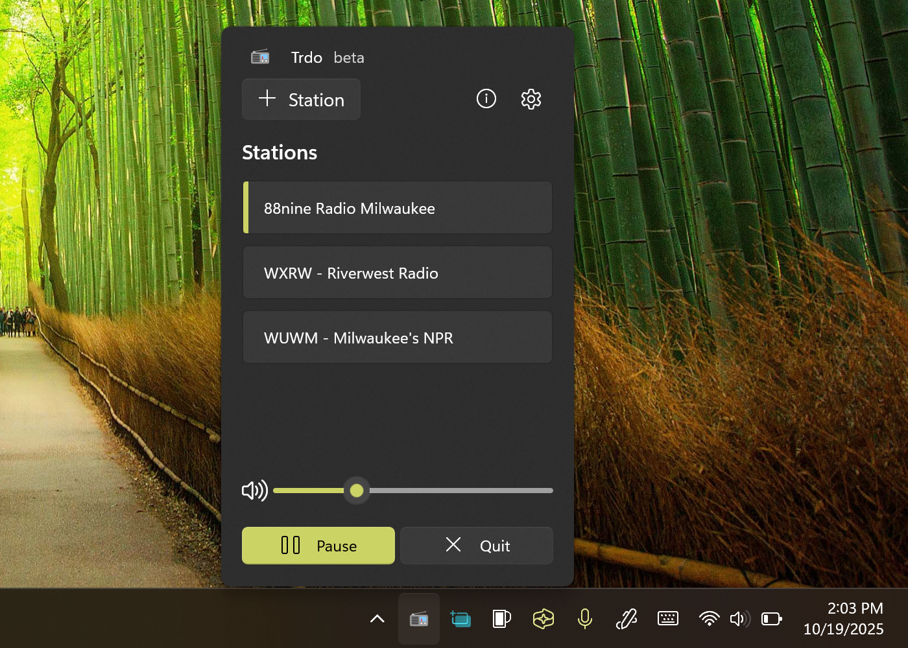



  

<h1 align="center">
  Trdo
</h1>

  A simple, elegant internet radio player for Windows

  

### Overview
Trdo is a modern internet radio player built for Windows with a focus on simplicity and elegance. Stream your favorite radio stations with a beautiful, intuitive interface designed for Windows 11.

Built with .NET 9, WinUI 3, and the Windows App SDK, Trdo provides a native Windows experience with smooth animations and responsive controls.

## How to Build
Get the code:
- Install git: https://git-scm.com/download/win
- git clone https://github.com/TheJoeFin/Trdo.git

### With Visual Studio 2022
- Install Visual Studio 2022 (the free community edition is sufficient).
    - Install the ".NET desktop development" workload.
    - Install "Windows application development" workload with Windows App SDK
- Open `\Trdo\Trdo.sln` in Visual Studio.
- Key F5 or Press "▶ Local Machine"

### With Visual Studio Code (VS Code)
- Install Visual Studio Code https://code.visualstudio.com/
- Install .NET 9.0 SDK https://dotnet.microsoft.com/download/dotnet/9.0
- Open `\Trdo\` Folder in VS Code (Same folder as .sln file)
- Key F5 to launch with debugger

## 🎯 Features

- 📡 Stream internet radio stations from around the world
- 🎨 Modern, clean user interface with Fluent Design
- ⚙️ Customizable settings
- 🔊 High-quality audio playback
- 💾 Save and organize your favorite stations
- 🎵 Now playing information display
- 🌙 Support for Windows 11 themes

## 🛠️ Built With

- .NET 9
- WinUI 3
- Windows App SDK
- WinUIEx

## Principles
Trdo is designed to be simple and elegant, focusing on what matters most: enjoying your favorite radio stations. By leveraging modern Windows technologies, Trdo provides a smooth, native experience that feels at home on Windows 11. The interface is designed to be intuitive and uncluttered, letting you focus on discovering and listening to great content.

### Packages Used
Will be updated as development progresses.

### Thanks for using Trdo
Hopefully this simple app makes listening to internet radio enjoyable and hassle-free.
If you have any questions or feedback reach out on Twitter [@TheJoeFin](http://www.twitter.com/thejoefin) or through GitHub issues.

## 📝 License

This project is licensed under the MIT License - see the [LICENSE.txt](LICENSE.txt) file for details.

## 👤 Author

**Joe Finney (TheJoeFin)**

- GitHub: [@TheJoeFin](https://github.com/TheJoeFin)
- Twitter: [@TheJoeFin](https://twitter.com/thejoefin)

## 🤝 Contributing

Contributions, issues, and feature requests are welcome! Feel free to check the [issues page](https://github.com/TheJoeFin/Trdo/issues).

## ⭐ Show your support

Give a ⭐️ if this project helped you!

---

Made with ❤️ by [Joe Finney](https://github.com/TheJoeFin)

