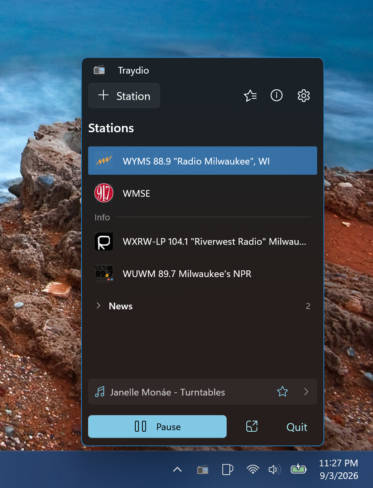

  

<h1 align="center">
  Traydio
</h1>

<h3 align="center">

  Formerly Trdo

</h3>

  A simple, elegant internet radio player for Windows

  

> **📢 Now Traydio:** As of version 2.0, Trdo is named **Traydio** — same app, clearer name.

### Overview

Traydio (formerly Trdo) is a modern internet radio player built for Windows with a focus on simplicity and elegance. Stream your favorite radio stations with a beautiful, intuitive interface designed for Windows 11.

Built with .NET 10, WinUI 3, and the Windows App SDK, Traydio provides a native Windows experience with smooth animations and responsive controls.

## 📰 In the Press

- **[Wired](https://www.wired.com/story/trdo-is-a-great-free-radio-app-for-windows/)** — *"Trdo Is a Great Free Radio App for Windows"* — Justin Pot
- **[MakeUseOf](https://www.makeuseof.com/trdo-tiny-windows-app-brought-back-my-love-for-internet-radio-its-open-source/)** — *"Trdo: This Tiny Windows App Brought Back My Love for Internet Radio (And It's Open Source)"* — Tashreef Shareef, January 2026
- **[WinFuture](https://winfuture.de/download/product/4193/)** *(German)* — Trdo featured as a modern, minimalist internet radio player for Windows 11

## How to Build

Get the code:

- Install git: [https://git-scm.com/download/win](https://git-scm.com/download/win)
- git clone [https://github.com/TheJoeFin/Trdo.git](https://github.com/TheJoeFin/Trdo.git)

### With Visual Studio 2026

- Install Visual Studio 2026 (the free community edition is sufficient).
  
    - Install the ".NET desktop development" workload.
    - Install "Windows application development" workload with Windows App SDK
- Open `\Trdo\Trdo.slnx` in Visual Studio.
- Key F5 or Press "▶ Local Machine"

### With Visual Studio Code (VS Code)

- Install Visual Studio Code [https://code.visualstudio.com/](https://code.visualstudio.com/)
- Install .NET 10 SDK [https://dotnet.microsoft.com/download/dotnet/10.0](https://dotnet.microsoft.com/download/dotnet/10.0)
- Open `\Trdo\` Folder in VS Code (Same folder as .sln file)
- Key F5 to launch with debugger

## 🎯 Features

- 📡 Stream internet radio stations from around the world
- 🎨 Modern, clean user interface with Fluent Design
- ⚙️ Customizable settings
- 🔊 High-quality audio playback
- 💾 Save and organize your favorite stations
- 📁 Collapsible groups, dividers and non-destructive sorting for longer station lists
- 🎵 Now playing information display
- 🌙 Support for Windows 11 themes

## 🛠️ Built With

- .NET 10
- WinUI
- Windows App SDK
- WinUIEx

## Principles

Traydio is designed to be simple and elegant, focusing on what matters most: enjoying your favorite radio stations. By leveraging modern Windows technologies, Traydio provides a smooth, native experience that feels at home on Windows 11. The interface is designed to be intuitive and uncluttered, letting you focus on discovering and listening to great content.

### Packages Used

- [CommunityToolkit.Mvvm](https://www.nuget.org/packages/CommunityToolkit.Mvvm) — MVVM helpers (observable objects, commands)
- [CommunityToolkit.WinUI.Animations](https://www.nuget.org/packages/CommunityToolkit.WinUI.Animations) — UI animation helpers
- [CommunityToolkit.WinUI.Controls.Segmented](https://www.nuget.org/packages/CommunityToolkit.WinUI.Controls.Segmented) — Segmented control
- [CommunityToolkit.Labs.WinUI.MarqueeText](https://www.nuget.org/packages/CommunityToolkit.Labs.WinUI.MarqueeText) — Scrolling marquee text
- [LibVLCSharp](https://www.nuget.org/packages/LibVLCSharp) + [VideoLAN.LibVLC.Windows](https://www.nuget.org/packages/VideoLAN.LibVLC.Windows) — Stream playback engine
- [NAudio](https://www.nuget.org/packages/NAudio) — Audio playback and processing
- [Microsoft.WindowsAppSDK](https://www.nuget.org/packages/Microsoft.WindowsAppSDK) — Windows App SDK / WinUI 3
- [Microsoft.Windows.CsWin32](https://www.nuget.org/packages/Microsoft.Windows.CsWin32) — Source-generated Win32 P/Invoke bindings
- [WinUIEx](https://www.nuget.org/packages/WinUIEx) — WinUI window extensions

Tests (`Trdo.Tests`) use [MSTest](https://www.nuget.org/packages/MSTest.TestFramework) via `Microsoft.NET.Test.Sdk`.

### Thanks for using Traydio

Hopefully this simple app makes listening to internet radio enjoyable and hassle-free.  
If you have any questions or feedback reach out on Twitter [@TheJoeFin](http://www.twitter.com/thejoefin) or through GitHub issues.

## 📝 License

This project is licensed under the MIT License - see the [LICENSE.txt](LICENSE.txt) file for details.

## 👤 Author

**Joe Finney (TheJoeFin)**

- GitHub: [@TheJoeFin](https://github.com/TheJoeFin)
- Twitter: [@TheJoeFin](https://twitter.com/thejoefin)

## 🤝 Contributing

Contributions, issues, and feature requests are welcome! Feel free to check the [issues page](https://github.com/TheJoeFin/Trdo/issues).

## ⭐ Show your support

Give a ⭐️ if this project helped you!

---

Made with ❤️ by [Joe Finney](https://github.com/TheJoeFin)

